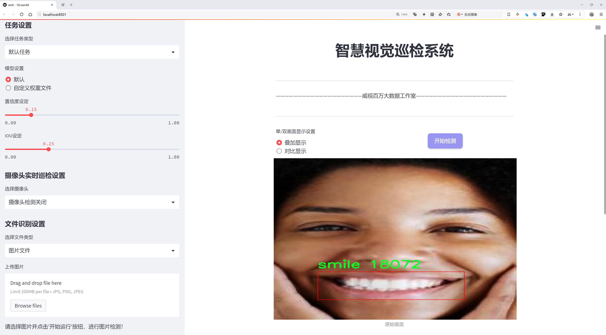
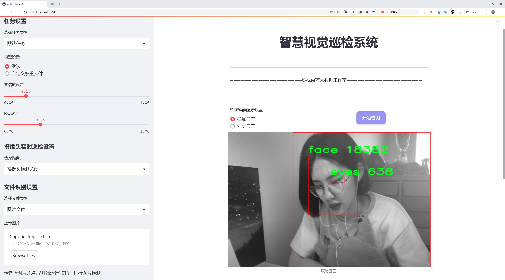
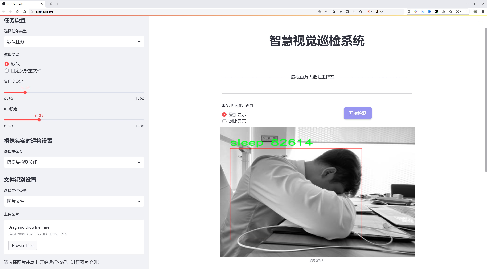
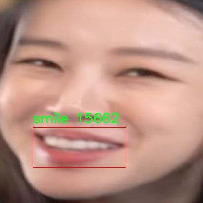
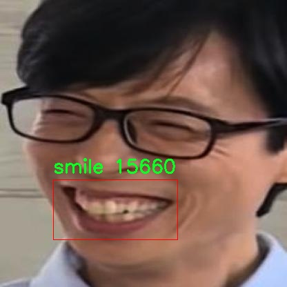
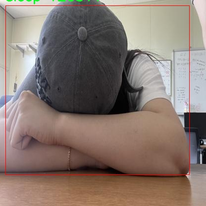
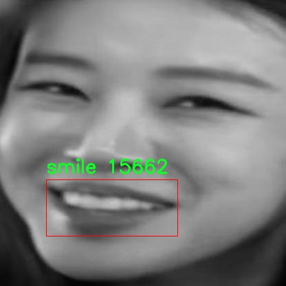
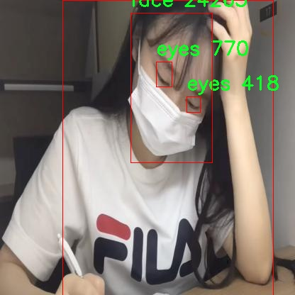

# 人脸表情行为识别系统源码分享
 # [一条龙教学YOLOV8标注好的数据集一键训练_70+全套改进创新点发刊_Web前端展示]

### 1.研究背景与意义

项目参考[AAAI Association for the Advancement of Artificial Intelligence](https://gitee.com/qunmasj/projects)

项目来源[AACV Association for the Advancement of Computer Vision](https://kdocs.cn/l/cszuIiCKVNis)

研究背景与意义

随着人工智能技术的迅猛发展，计算机视觉领域的研究逐渐深入，尤其是在目标检测和人脸表情识别方面。人脸表情不仅是人类情感的重要表达方式，也是人机交互、心理分析、社交网络等多个领域的关键要素。传统的人脸表情识别方法多依赖于手工特征提取，准确性和鲁棒性较低，难以适应复杂多变的实际应用场景。近年来，深度学习技术的崛起为这一领域带来了新的机遇，尤其是基于卷积神经网络（CNN）的目标检测模型，如YOLO（You Only Look Once）系列，因其高效性和实时性受到广泛关注。

YOLOv8作为YOLO系列的最新版本，结合了多种先进的深度学习技术，具有更高的检测精度和更快的推理速度。通过对YOLOv8模型的改进，可以进一步提升其在复杂场景下的人脸表情行为识别能力。本研究旨在基于改进的YOLOv8模型，构建一个高效的人脸表情行为识别系统，以实现对人类情感状态的准确识别和分析。

本研究所使用的数据集包含1400张图像，涵盖了五个主要类别：眼睛、面部、睡眠、微笑和站立。这些类别不仅涵盖了人脸表情的基本元素，还涉及到与情感相关的行为特征。通过对这些数据的分析和处理，能够有效提取出人脸表情的关键特征，为后续的模型训练提供丰富的样本支持。尤其是在现代社会中，情感识别在教育、医疗、安防等领域的应用潜力巨大，能够帮助我们更好地理解和应对人类情感的复杂性。

此外，随着社交媒体和在线交流的普及，人们的情感表达方式也日益多样化。基于改进YOLOv8的人脸表情行为识别系统，能够实时捕捉和分析用户的情感状态，为社交平台提供个性化的用户体验和情感反馈。这不仅有助于提升用户的互动体验，也为企业提供了重要的市场洞察，帮助其更好地满足消费者的需求。

总之，基于改进YOLOv8的人脸表情行为识别系统的研究，不仅具有重要的学术价值，还有着广泛的应用前景。通过深入探讨人脸表情的识别技术，我们能够推动计算机视觉领域的发展，为人机交互、情感计算等前沿研究提供新的思路和方法。这一研究不仅将促进相关技术的进步，也将为社会各界提供更为精准的情感识别解决方案，具有重要的理论意义和实践价值。

### 2.图片演示







##### 注意：由于此博客编辑较早，上面“2.图片演示”和“3.视频演示”展示的系统图片或者视频可能为老版本，新版本在老版本的基础上升级如下：（实际效果以升级的新版本为准）

  （1）适配了YOLOV8的“目标检测”模型和“实例分割”模型，通过加载相应的权重（.pt）文件即可自适应加载模型。

  （2）支持“图片识别”、“视频识别”、“摄像头实时识别”三种识别模式。

  （3）支持“图片识别”、“视频识别”、“摄像头实时识别”三种识别结果保存导出，解决手动导出（容易卡顿出现爆内存）存在的问题，识别完自动保存结果并导出到tempDir中。

  （4）支持Web前端系统中的标题、背景图等自定义修改，后面提供修改教程。

  另外本项目提供训练的数据集和训练教程,暂不提供权重文件（best.pt）,需要您按照教程进行训练后实现图片演示和Web前端界面演示的效果。

### 3.视频演示

[3.1 视频演示](https://www.bilibili.com/video/BV1AU2nY9E42/)

### 4.数据集信息展示

##### 4.1 本项目数据集详细数据（类别数＆类别名）

nc: 5
names: ['eyes', 'face', 'sleep', 'smile', 'stand']


##### 4.2 本项目数据集信息介绍

数据集信息展示

在现代计算机视觉领域，尤其是在情感识别和人机交互的研究中，数据集的质量和多样性对模型的训练效果至关重要。本研究所采用的“capstone”数据集专门用于训练和改进YOLOv8的人脸表情行为识别系统，旨在提升系统对人类情感状态的识别能力。该数据集包含五个主要类别，分别为“eyes”（眼睛）、“face”（面部）、“sleep”（睡眠）、“smile”（微笑）和“stand”（站立），这些类别涵盖了人类情感表达的多个方面，能够为模型提供丰富的特征信息。

首先，数据集中的“eyes”类别关注于眼部表情的变化，眼睛是情感表达的重要窗口。通过对眼睛的状态进行细致的标注，模型能够学习到不同情感下眼睛的微妙变化，如眨眼、睁大或半闭等。这些变化不仅能反映出个体的情绪状态，还能为后续的情感分析提供重要的上下文信息。

其次，“face”类别则涵盖了面部的整体表情，包括眉毛、嘴巴和脸颊等部位的动态变化。面部表情是人类情感表达的核心，能够直接传达快乐、悲伤、愤怒等多种情绪。通过对面部表情的系统化标注，数据集为模型提供了丰富的样本，使其能够在多种情境下准确识别和分类不同的情感状态。

在“sleep”类别中，数据集专注于识别与睡眠相关的表情和姿态。睡眠状态的表征不仅包括闭眼、面部放松等静态特征，还可能涉及到与睡眠质量相关的微妙变化。这一类别的引入使得模型能够更全面地理解个体在不同情境下的情感波动，尤其是在疲劳或放松状态下的情感表达。

“smile”类别则是数据集中最具积极情感特征的部分。微笑作为一种普遍的情感表达方式，具有极强的社交功能。通过对微笑的标注，模型可以学习到如何区分真诚的微笑与礼貌的微笑，从而更准确地判断个体的情感状态。这一类别的多样性和复杂性为模型的训练提供了丰富的挑战和机遇。

最后，“stand”类别则涉及到个体的姿态和站立状态，这一特征与情感表达密切相关。个体的站立姿态往往能够反映出其内心的自信、放松或紧张等情绪。通过对这一类别的分析，模型能够更全面地理解情感表达的多维度特征，从而提升其在复杂社交场景中的识别能力。

综上所述，“capstone”数据集以其多样的类别和丰富的情感特征，为改进YOLOv8的人脸表情行为识别系统提供了坚实的基础。通过对这五个类别的深入分析和训练，模型不仅能够在标准情境下进行情感识别，还能够在复杂多变的社交环境中展现出更高的准确性和鲁棒性。这一数据集的应用将为未来的情感计算和人机交互研究开辟新的方向，推动相关领域的进一步发展。











### 5.全套项目环境部署视频教程（零基础手把手教学）

[5.1 环境部署教程链接（零基础手把手教学）](https://www.ixigua.com/7404473917358506534?logTag=c807d0cbc21c0ef59de5)


[5.2 安装Python虚拟环境创建和依赖库安装视频教程链接（零基础手把手教学）](https://www.ixigua.com/7404474678003106304?logTag=1f1041108cd1f708b01a)

### 6.手把手YOLOV8训练视频教程（零基础小白有手就能学会）

[6.1 手把手YOLOV8训练视频教程（零基础小白有手就能学会）](https://www.ixigua.com/7404477157818401292?logTag=d31a2dfd1983c9668658)


按照上面的训练视频教程链接加载项目提供的数据集，运行train.py即可开始训练



     Epoch   gpu_mem       box       obj       cls    labels  img_size
     1/200     20.8G   0.01576   0.01955  0.007536        22      1280: 100%|██████████| 849/849 [14:42<00:00,  1.04s/it]
               Class     Images     Labels          P          R     mAP@.5 mAP@.5:.95: 100%|██████████| 213/213 [01:14<00:00,  2.87it/s]
                 all       3395      17314      0.994      0.957      0.0957      0.0843

     Epoch   gpu_mem       box       obj       cls    labels  img_size
     2/200     20.8G   0.01578   0.01923  0.007006        22      1280: 100%|██████████| 849/849 [14:44<00:00,  1.04s/it]
               Class     Images     Labels          P          R     mAP@.5 mAP@.5:.95: 100%|██████████| 213/213 [01:12<00:00,  2.95it/s]
                 all       3395      17314      0.996      0.956      0.0957      0.0845

     Epoch   gpu_mem       box       obj       cls    labels  img_size
     3/200     20.8G   0.01561    0.0191  0.006895        27      1280: 100%|██████████| 849/849 [10:56<00:00,  1.29it/s]
               Class     Images     Labels          P          R     mAP@.5 mAP@.5:.95: 100%|███████   | 187/213 [00:52<00:00,  4.04it/s]
                 all       3395      17314      0.996      0.957      0.0957      0.0845


### 7.70+种全套YOLOV8创新点代码加载调参视频教程（一键加载写好的改进模型的配置文件）

[7.1 70+种全套YOLOV8创新点代码加载调参视频教程（一键加载写好的改进模型的配置文件）](https://www.ixigua.com/7404478314661806627?logTag=29066f8288e3f4eea3a4)

### 8.70+种全套YOLOV8创新点原理讲解（非科班也可以轻松写刊发刊，V10版本正在科研待更新）

#### 由于篇幅限制，每个创新点的具体原理讲解就不一一展开，具体见下列网址中的创新点对应子项目的技术原理博客网址【Blog】：


[8.1 70+种全套YOLOV8创新点原理讲解链接](https://gitee.com/qunmasj/good)

#### 部分改进原理讲解(完整的改进原理见上图和技术博客链接)
### 深度学习基础
卷积神经网络通过使用具有共享参数的卷积运算显著降低了模型的计算开销和复杂性。在LeNet、AlexNet和VGG等经典网络的驱动下，卷积神经网络现在已经建立了一个完整的系统，并在深度学习领域形成了先进的卷积神经网络模型。

感受野注意力卷积RFCBAMConv的作者在仔细研究了卷积运算之后获得了灵感。对于分类、目标检测和语义分割任务，一方面，图像中不同位置的对象的形状、大小、颜色和分布是可变的。在卷积操作期间，卷积核在每个感受野中使用相同的参数来提取信息，而不考虑来自不同位置的差分信息。这限制了网络的性能，这已经在最近的许多工作中得到了证实。

另一方面，卷积运算没有考虑每个特征的重要性，这进一步影响了提取特征的有效性，并最终限制了模型的性能。此外，注意力机制允许模型专注于重要特征，这可以增强特征提取的优势和卷积神经网络捕获详细特征信息的能力。因此，注意力机制在深度学习中得到了广泛的应用，并成功地应用于各个领域。

通过研究卷积运算的内在缺陷和注意力机制的特点，作者认为现有的空间注意力机制从本质上解决了卷积运算的参数共享问题，但仍局限于对空间特征的认知。对于较大的卷积核，现有的空间注意力机制并没有完全解决共享参数的问题。此外，他们无法强调感受野中每个特征的重要性，例如现有的卷积块注意力模块（CBAM）和 Coordinate注意力（CA）。

因此，[参考该博客提出了一种新的感受野注意力机制（RFA）](https://qunmasj.com)，它完全解决了卷积核共享参数的问题，并充分考虑了感受野中每个特征的重要性。通过RFA设计的卷积运算（RFAConv）是一种新的卷积运算，可以取代现有神经网络中的标准卷积运算。RFAConv通过添加一些参数和计算开销来提高网络性能。

大量关于Imagnet-1k、MS COCO和VOC的实验已经证明了RFAConv的有效性。作为一种由注意力构建的新型卷积运算，它超过了由CAM、CBAM和CA构建的卷积运算（CAMConv、CBAMConv、CAConv）以及标准卷积运算。

此外，为了解决现有方法提取感受野特征速度慢的问题，提出了一种轻量级操作。在构建RFAConv的过程中，再次设计了CA和CBAM的升级版本，并进行了相关实验。作者认为当前的空间注意力机制应该将注意力放在感受野空间特征上，以促进当前空间注意力机制的发展，并再次增强卷积神经网络架构的优势。


### 卷积神经网络架构
出色的神经网络架构可以提高不同任务的性能。卷积运算作为卷积神经网络的一种基本运算，推动了人工智能的发展，并为车辆检测、无人机图像、医学等先进的网络模型做出了贡献。He等人认为随着网络深度的增加，该模型将变得难以训练并产生退化现象，因此他们提出了残差连接来创新卷积神经网络架构的设计。Huang等人通过重用特征来解决网络梯度消失问题，增强了特征信息，他们再次创新了卷积神经网络架构。

通过对卷积运算的详细研究，Dai等人认为，具有固定采样位置的卷积运算在一定程度上限制了网络的性能，因此提出了Deformable Conv，通过学习偏移来改变卷积核的采样位置。在Deformable Conv的基础上，再次提出了Deformable Conv V2和Deformable Conv V3，以提高卷积网络的性能。

Zhang等人注意到，组卷积可以减少模型的参数数量和计算开销。然而，少于组内信息的交互将影响最终的网络性能。1×1的卷积可以与信息相互作用。然而，这将带来更多的参数和计算开销，因此他们提出了无参数的“通道Shuffle”操作来与组之间的信息交互。

Ma等人通过实验得出结论，对于参数较少的模型，推理速度不一定更快，对于计算量较小的模型，推理也不一定更快。经过仔细研究提出了Shufflenet V2。

YOLO将输入图像划分为网格，以预测对象的位置和类别。经过不断的研究，已经提出了8个版本的基于YOLO的目标检测器，如YOLOv5、YOLOv7、YOLOv8等。上述卷积神经网络架构已经取得了巨大的成功。然而，它们并没有解决提取特征过程中的参数共享问题。本文的工作从注意力机制开始，从一个新的角度解决卷积参数共享问题。

### 注意力机制
注意力机制被用作一种提高网络模型性能的技术，使其能够专注于关键特性。注意力机制理论已经在深度学习中建立了一个完整而成熟的体系。Hu等人提出了一种Squeeze-and-Excitation（SE）块，通过压缩特征来聚合全局通道信息，从而获得与每个通道对应的权重。Wang等人认为，当SE与信息交互时，单个通道和权重之间的对应关系是间接的，因此设计了高效通道注Efficient Channel Attention力（ECA），并用自适应kernel大小的一维卷积取代了SE中的全连接（FC）层。Woo等人提出了卷积块注意力模块（CBAM），它结合了通道注意力和空间注意力。作为一个即插即用模块，它可以嵌入卷积神经网络中，以提高网络性能。

尽管SE和CBAM已经提高了网络的性能。Hou等人仍然发现压缩特征在SE和CBAM中丢失了太多信息。因此，他们提出了轻量级Coordinate注意力（CA）来解决SE和CBAM中的问题。Fu等人计了一个空间注意力模块和通道注意力模块，用于扩展全卷积网络（FCN），分别对空间维度和通道维度的语义相关性进行建模。Zhang等人在通道上生成不同尺度的特征图，以建立更有效的通道注意力机制。

本文从一个新的角度解决了标准卷积运算的参数共享问题。这就是将注意力机制结合起来构造卷积运算。尽管目前的注意力机制已经获得了良好的性能，但它们仍然没有关注感受野的空间特征。因此，设计了具有非共享参数的RFA卷积运算，以提高网络的性能。


#### 回顾标准卷积
以标准卷积运算为基础构建卷积神经网络，通过共享参数的滑动窗口提取特征信息，解决了全连接层构建的神经网络的固有问题（即参数数量大、计算开销高）。

设表示输入特征图，其中、和分别表示特征图的通道数、高度和宽度。为了能够清楚地展示卷积核提取特征信息的过程，以为例。提取每个感受野slider的特征信息的卷积运算可以表示如下：


这里，表示在每次卷积slider操作之后获得的值，表示在每个slider内的相应位置处的像素值。表示卷积核，表示卷积核中的参数数量，表示感受野slider的总数。

可以看出，每个slider内相同位置的特征共享相同的参数。因此，标准的卷积运算无法感知不同位置带来的差异信息，这在一定程度上限制了卷积神经网络的性能。

#### 回顾空间注意力
目前，空间注意力机制使用通过学习获得的注意力图来突出每个特征的重要性。与上一节类似，以为例。突出关键特征的空间注意力机制可以简单地表达如下：


这里，表示在加权运算之后获得的值。和分别表示输入特征图和学习注意力图在不同位置的值，是输入特征图的高度和宽度的乘积，表示像素值的总数。一般来说，整个过程可以简单地表示在图1中。


#### 空间注意力与标准卷积
众所周知，将注意力机制引入卷积神经网络可以提高网络的性能。通过标准的卷积运算和对现有空间注意力机制的仔细分析。作者认为空间注意力机制本质上解决了卷积神经网络的固有缺点，即共享参数的问题。

目前，该模型最常见的卷积核大小为1×1和3×3。引入空间注意力机制后用于提取特征的卷积操作是1×1或3×3卷积操作。这个过程可以直观地显示出来。空间注意力机制被插入到1×1卷积运算的前面。通过注意力图对输入特征图进行加权运算（Re-weight“×”），最后通过1×1卷积运算提取感受野的slider特征信息。

整个过程可以简单地表示如下：


 

这里，卷积核仅表示一个参数值。如果将的值作为一个新的卷积核参数，那么有趣的是，通过1×1卷积运算提取特征时的参数共享问题得到了解决。然而，空间注意力机制的传说到此结束。当空间注意力机制被插入到3×3卷积运算的前面时。具体情况如下：


如上所述，如果取的值。作为一种新的卷积核参数，上述方程完全解决了大规模卷积核的参数共享问题。然而，最重要的一点是，卷积核在每个感受野slider中提取将共享部分特征的特征。换句话说，在每个感受野slider内都会有重叠。

经过仔细分析发现，，…，空间注意力图的权重在每个slider内共享。因此，空间注意机制不能解决大规模卷积核共享参数的问题，因为它们不注意感受野的空间特征。在这种情况下，空间注意力机制是有限的。
#### 创新空间注意力与标准卷积
RFA是为了解决空间注意力机制问题而提出的，创新了空间注意力。使用与RFA相同的思想，一系列空间注意力机制可以再次提高性能。RFA设计的卷积运算可以被视为一种轻量级的即插即用模块，以取代标准卷积，从而提高卷积神经网络的性能。因此，作者认为空间注意力机制和标准卷积在未来将有一个新的春天。

感受野的空间特征：

现在给出感受野空间特征的定义。它是专门为卷积核设计的，并根据kernel大小动态生成，如图2所示，以3×3卷积核为例。


在图2中，“空间特征”表示原始特征图，等于空间特征。“感受野空间特征”表示变换后的特征，该特征由每个感受野slider滑块组成，并且不重叠。也就是说，“感受野空间特征”中的每个3×3大小的slider表示提取原始3×3卷积特征时所有感觉野slider的特征。

#### 感受野注意力卷积(RFA):

关于感受野空间特征，该博客的作者提出了感受野注意（RFA），它不仅强调了感受野slider内各种特征的重要性，而且还关注感受野空间特性，以彻底解决卷积核参数共享的问题。感受野空间特征是根据卷积核的大小动态生成的，因此，RFA是卷积的固定组合，不能脱离卷积运算的帮助，卷积运算同时依赖RFA来提高性能。

因此，作者提出了感受野注意力卷积（RFAConv）。具有3×3大小卷积核的RFAConv的总体结构如图3所示。


目前，提取感受野特征最常用的方法速度较慢，因此经过不断探索提出了一种快速的方法，通过分组卷积来取代原来的方法。

具体来说，根据感受野大小，使用相应的组卷积大小来动态生成展开特征。尽管与原始的无参数方法（如Pytorch提供的nn.Unfld()）相比，该方法添加了一些参数，但速度要快得多。

注意：正如在上一节中提到的，当原始的3×3卷积核提取特征时，感受野空间特征中的每个3×3大小的窗口表示所有感受野滑块的特征。但在快速分组卷积提取感受野特征后，由于原始方法太慢，它们会被映射到新的特征中。

最近的一些工作已经证明信息交互可以提高网络性能。类似地，对于RFAConv，与感受野特征信息交互以学习注意力图可以提高网络性能，但与每个感受野特征交互将带来额外的计算开销。为了确保少量的计算开销和参数数量，通过探索使用AvgPool池化每个感受野特征的全局信息，然后通过1×1组卷积运算与信息交互。最后，softmax用于强调感受野特征中每个特征的重要性。通常，RFA的计算可以表示为：


表示分组卷积，表示卷积核的大小，代表规范化，表示输入特征图，是通过将注意力图与变换的感受野空间特征相乘而获得的。

与CBAM和CA不同，RFA可以为每个感受野特征生成注意力图。标准卷积受到卷积神经网络性能的限制，因为共享参数的卷积运算对位置带来的差异信息不敏感。RFA完全可以解决这个问题，具体细节如下：


由于RFA获得的特征图是“调整形状”后不重叠的感受野空间特征，因此通过池化每个感受野滑块的特征信息来学习学习的注意力图。换句话说，RFA学习的注意力图不再在每个感受野slider内共享，并且是有效的。这完全解决了现有的CA和CBAM对大尺寸kernel的注意力机制中的参数共享问题。

同时，RFA给标准卷积核带来了相当大的好处，但调整形状后，特征的高度和宽度是k倍，需要进行k×k的stride卷积运算，才能提取特征信息。RFAConv创新了标准卷积运算。

此外，空间注意力机制将得到升级，因为作者认为现有的空间注意力机制应该专注于感受野空间特征，以提高网络的性能。众所周知，基于自注意力机制的网络模型取得了巨大的成功，因为它解决了卷积参数共享的问题，并对远程信息进行了建模，但基于自注意力机理的方法给模型带来了巨大的计算开销和复杂性。作者认为通过将一些现有空间注意力机制的注意力放在感受野空间特征中，它以轻量级的方式解决了自注意力机制的问题。

答案如下：

将关注感受野空间特征的空间注意力与卷积相匹配，完全解决了卷积参数共享的问题；

当前的空间注意力机制本身具有考虑远距离信息的特点，它们通过全局平均池化或全局最大池化来获得全局信息，这在一定程度上考虑了远距离信息。


为此，作者设计了一种新的CBAM和CA，称为RFACBAM和RFACA，它专注于感受野的空间特征。与RFA类似，使用stride为k的k×k的最终卷积运算来提取特征信息，具体结构如图4和图5所示，将这2种新的卷积方法称为RFCBAMConv和RFCAConv。比较原始的CBAM，使用SE注意力来代替RFCBAM中的CAM。因为这样可以减少计算开销。


此外，在RFCBAM中，通道和空间注意力不是在单独的步骤中执行的，因为通道和空间注意力是同时加权的，从而允许在每个通道上获得的注意力图是不同的。


### 9.系统功能展示（检测对象为举例，实际内容以本项目数据集为准）

图9.1.系统支持检测结果表格显示

  图9.2.系统支持置信度和IOU阈值手动调节

  图9.3.系统支持自定义加载权重文件best.pt(需要你通过步骤5中训练获得)

  图9.4.系统支持摄像头实时识别

  图9.5.系统支持图片识别

  图9.6.系统支持视频识别

  图9.7.系统支持识别结果文件自动保存

  图9.8.系统支持Excel导出检测结果数据


### 10.原始YOLOV8算法原理

原始YOLOv8算法原理

YOLOv8算法是目标检测领域的一次重要突破，继承并发展了YOLO系列算法的优良传统，致力于在保持高效性的同时，进一步提升检测精度。该算法的核心思想在于将目标检测任务视为一个回归问题，通过一个统一的神经网络模型，实时预测目标的位置和类别。与之前的YOLO版本相比，YOLOv8在网络结构和损失函数的设计上进行了多项创新，旨在实现更快的检测速度和更高的检测精度。

首先，YOLOv8的网络结构分为三个主要部分：主干网络（Backbone）、特征增强网络（Neck）和检测头（Head）。在主干网络中，YOLOv8依然采用了跨级结构（Cross Stage Partial, CSP）的设计理念，旨在通过更高效的特征提取来增强模型的表现。与YOLOv5相比，YOLOv8对C3模块进行了优化，采用了更轻量的C2f模块，这一新模块通过增加残差连接，显著提高了梯度信息的传递效率，进而增强了网络的学习能力。

在特征增强网络方面，YOLOv8引入了PAN-FPN（Path Aggregation Network - Feature Pyramid Network）的结构，进一步提升了多尺度特征的融合能力。不同于以往版本在上采样阶段使用卷积结构，YOLOv8则将这一部分进行了简化，直接利用特征图的高效组合，降低了计算复杂度。这种设计不仅提升了模型的速度，还在一定程度上减少了内存消耗，使得YOLOv8能够在资源受限的环境中也能高效运行。

在检测头部分，YOLOv8采用了解耦合头结构，将分类和回归任务分离为两个独立的分支。这一设计使得模型在处理复杂场景时，能够更专注于各自的任务，从而有效降低了定位不准和分类错误的概率。与此同时，YOLOv8引入了Anchor-free目标检测方法，摒弃了传统的锚点框概念，直接通过回归方式预测目标的位置和大小。这一创新使得模型在面对不同尺度和形状的目标时，能够更加灵活地进行调整，快速聚焦于目标的实际边界。

YOLOv8在损失函数的设计上也进行了重要的改进。通过引入变焦损失（Focal Loss）来计算分类损失，并结合数据平均保真度损失和完美交并比损失（CIoU Loss）来计算边界框损失，YOLOv8实现了对目标检测任务的更精确优化。这种新的损失策略使得模型在训练过程中能够更好地处理难以分类的样本，显著提升了检测的准确性。

此外，YOLOv8在数据增强方面也进行了创新，采用了动态的样本分配策略，使得训练过程中的样本选择更加灵活。这种方法能够有效提升模型对不同场景的适应能力，进而增强其在实际应用中的表现。

在整体性能上，YOLOv8相比于前几代YOLO算法，在训练时间和检测精度上均有显著提升。其模型的权重文件经过进一步轻量化处理，使得YOLOv8能够被广泛部署到各种嵌入式设备中，满足实时检测的需求。这一特性使得YOLOv8在安防监控、自动驾驶、智能交通等领域展现出广泛的应用前景。

总的来说，YOLOv8算法通过对网络结构的优化、损失函数的改进以及数据增强策略的创新，成功实现了在高效率基础上的准确目标检测。它不仅延续了YOLO系列的优良传统，更在多个方面进行了有效的创新，为目标检测技术的发展提供了新的思路和方向。随着YOLOv8的不断应用和推广，未来的目标检测任务将更加高效、精准，为各行各业的智能化进程提供强有力的支持。


### 11.项目核心源码讲解（再也不用担心看不懂代码逻辑）

#### 11.1 code\ultralytics\data\explorer\gui\__init__.py

当然可以！请提供您希望分析的代码文件内容，我将帮助您提取核心部分并进行详细注释。

这个文件是Ultralytics YOLO项目的一部分，文件路径为`code/ultralytics/data/explorer/gui/__init__.py`。从文件名和路径来看，它可能是一个用于图形用户界面（GUI）相关功能的初始化文件。

在Python中，`__init__.py`文件的主要作用是将包含该文件的目录标识为一个包，这样就可以通过导入该包来使用其中的模块和功能。尽管在这个文件中只有一行注释，内容是“# Ultralytics YOLO 🚀, AGPL-3.0 license”，但这行注释提供了一些重要的信息。

首先，这行注释表明这个项目是Ultralytics YOLO的一个实现，YOLO（You Only Look Once）是一种广泛使用的实时目标检测算法。Ultralytics是该算法的一个实现版本，通常以高效和易用著称。

其次，注释中提到的“AGPL-3.0 license”指的是该项目遵循的开源许可证。这种许可证允许用户自由使用、修改和分发软件，但要求在分发时也必须提供源代码，并且任何基于该软件的衍生作品也必须遵循相同的许可证。这意味着用户在使用Ultralytics YOLO时需要遵循这些条款。

总的来说，虽然这个`__init__.py`文件的内容非常简单，但它在整个项目中起到了重要的作用，标识了包的存在，并提供了关于项目及其许可证的信息。

#### 11.2 70+种YOLOv8算法改进源码大全和调试加载训练教程（非必要）\ultralytics\data\loaders.py

以下是代码中最核心的部分，并附上详细的中文注释：

```python
import cv2
import numpy as np
import torch
from pathlib import Path
from threading import Thread
from urllib.parse import urlparse

class LoadStreams:
    """
    用于加载各种类型视频流的类。

    支持使用 `yolo predict source='rtsp://example.com/media.mp4'` 进行实时视频流处理。

    属性:
        sources (str): 视频流的输入路径或URL。
        imgsz (int): 处理的图像大小，默认为640。
        vid_stride (int): 视频帧率步幅，默认为1。
        running (bool): 标志位，指示流线程是否正在运行。
        imgs (list): 每个流的图像帧列表。
        fps (list): 每个流的FPS列表。
        threads (list): 每个流的线程列表。
        caps (list): 每个流的cv2.VideoCapture对象列表。
    """

    def __init__(self, sources='file.streams', imgsz=640, vid_stride=1):
        """初始化实例变量并检查输入流形状的一致性。"""
        self.running = True  # 线程运行标志
        self.imgsz = imgsz  # 图像大小
        self.vid_stride = vid_stride  # 视频帧率步幅
        sources = Path(sources).read_text().rsplit() if os.path.isfile(sources) else [sources]
        self.sources = [x.strip() for x in sources]  # 清理源名称
        self.imgs, self.fps, self.threads, self.caps = [], [], [], []  # 初始化图像、FPS、线程和视频捕获对象列表

        for s in self.sources:  # 遍历每个源
            self.caps.append(cv2.VideoCapture(s))  # 创建视频捕获对象
            if not self.caps[-1].isOpened():
                raise ConnectionError(f'无法打开视频源: {s}')
            self.threads.append(Thread(target=self.update, args=(len(self.threads)-1, self.caps[-1]), daemon=True))  # 启动线程读取帧
            self.threads[-1].start()  # 启动线程

    def update(self, i, cap):
        """在守护线程中读取视频流的帧。"""
        while self.running and cap.isOpened():
            success, im = cap.read()  # 读取一帧
            if success:
                self.imgs.append(im)  # 将帧添加到图像列表
            else:
                break  # 如果读取失败，退出循环

    def close(self):
        """关闭流加载器并释放资源。"""
        self.running = False  # 停止线程
        for thread in self.threads:
            thread.join()  # 等待线程结束
        for cap in self.caps:
            cap.release()  # 释放视频捕获对象

    def __iter__(self):
        """返回一个迭代器对象。"""
        return self

    def __next__(self):
        """返回下一个图像用于处理。"""
        if not self.imgs:
            raise StopIteration  # 如果没有图像，停止迭代
        return self.imgs.pop(0)  # 返回并移除第一个图像

    def __len__(self):
        """返回源对象的长度。"""
        return len(self.sources)  # 返回源的数量
```

### 代码核心部分解释：
1. **LoadStreams 类**：该类用于加载视频流，支持多种输入源（如RTSP、RTMP等）。
2. **__init__ 方法**：初始化类的属性，读取输入源并创建视频捕获对象，启动线程以异步读取视频帧。
3. **update 方法**：在后台线程中不断读取视频流的帧，并将其存储在图像列表中。
4. **close 方法**：关闭所有打开的流和线程，释放资源。
5. **__iter__ 和 __next__ 方法**：实现迭代器协议，使得该类的实例可以被迭代，返回读取到的图像。
6. **__len__ 方法**：返回源的数量，便于在迭代时控制循环。 

通过这些核心部分，`LoadStreams` 类能够有效地处理视频流并提供实时图像数据供后续处理使用。

这个程序文件是用于YOLOv8算法的图像和视频数据加载的实现，主要包含多个类和方法，能够处理不同类型的数据源，包括视频流、截图、图像文件和PyTorch张量。程序中使用了许多库，如OpenCV、NumPy、PIL等，来支持图像和视频的处理。

首先，文件定义了一个`SourceTypes`类，用于表示不同类型的输入源，包含了摄像头、截图、图像和张量等属性。接着，`LoadStreams`类用于加载视频流，支持RTSP、RTMP、HTTP和TCP等多种流媒体协议。它的构造函数初始化了一些参数，如图像大小、视频帧率步幅等，并创建了多个线程来读取视频流中的帧。该类还实现了迭代器接口，使得可以逐帧读取视频流。

`LoadScreenshots`类用于加载屏幕截图，允许用户指定要捕获的屏幕区域。它使用`mss`库来进行屏幕捕获，并实现了迭代器接口，以便在每次迭代时返回捕获的图像。

`LoadImages`类则负责加载图像和视频文件，支持从单个文件、多个文件或目录中读取数据。它会检查文件类型并将其分类为图像或视频，支持逐帧读取视频内容。

`LoadPilAndNumpy`类用于从PIL和NumPy数组中加载图像，确保图像格式正确并转换为所需的格式。`LoadTensor`类则专门处理PyTorch张量输入，确保输入张量的形状和数据范围符合要求。

此外，文件中还定义了一些辅助函数，如`autocast_list`用于将不同类型的输入合并为NumPy数组或PIL图像，`get_best_youtube_url`用于从YouTube视频中提取最佳质量的MP4视频流地址。

总的来说，这个文件为YOLOv8算法提供了灵活的数据加载功能，支持多种输入源，方便用户进行图像处理和模型推理。

#### 11.3 ui.py

以下是代码中最核心的部分，并附上详细的中文注释：

```python
import sys
import subprocess

def run_script(script_path):
    """
    使用当前 Python 环境运行指定的脚本。

    Args:
        script_path (str): 要运行的脚本路径

    Returns:
        None
    """
    # 获取当前 Python 解释器的路径
    python_path = sys.executable

    # 构建运行命令，使用 streamlit 运行指定的脚本
    command = f'"{python_path}" -m streamlit run "{script_path}"'

    # 执行命令
    result = subprocess.run(command, shell=True)
    # 检查命令执行的返回码，如果不为0，表示出错
    if result.returncode != 0:
        print("脚本运行出错。")

# 实例化并运行应用
if __name__ == "__main__":
    # 指定要运行的脚本路径
    script_path = "web.py"  # 这里可以替换为实际的脚本路径

    # 调用函数运行脚本
    run_script(script_path)
```

### 代码说明：
1. **导入模块**：
   - `sys`：用于访问与 Python 解释器紧密相关的变量和函数。
   - `subprocess`：用于创建新进程、连接到它们的输入/输出/错误管道，并获得返回码。

2. **定义 `run_script` 函数**：
   - 该函数接受一个参数 `script_path`，表示要运行的 Python 脚本的路径。
   - 使用 `sys.executable` 获取当前 Python 解释器的路径，以确保使用正确的 Python 环境来运行脚本。
   - 构建一个命令字符串，使用 `streamlit` 模块运行指定的脚本。
   - 使用 `subprocess.run` 执行构建的命令，并检查返回码以确定脚本是否成功运行。

3. **主程序块**：
   - 在 `if __name__ == "__main__":` 块中，指定要运行的脚本路径（这里是 `web.py`）。
   - 调用 `run_script` 函数，执行指定的脚本。

这个程序文件名为 `ui.py`，主要功能是使用当前的 Python 环境来运行一个指定的脚本，具体是通过 Streamlit 来启动一个 Web 应用。

程序首先导入了必要的模块，包括 `sys`、`os` 和 `subprocess`，以及一个自定义的 `abs_path` 函数，这个函数可能用于获取脚本的绝对路径。

在 `run_script` 函数中，程序接受一个参数 `script_path`，这是要运行的脚本的路径。函数内部首先获取当前 Python 解释器的路径，存储在 `python_path` 变量中。接着，构建一个命令字符串，使用 `streamlit run` 命令来运行指定的脚本。这个命令会被传递给 `subprocess.run` 方法，该方法用于在子进程中执行命令。通过设置 `shell=True`，命令将在一个新的 shell 中执行。

在执行命令后，程序检查返回的结果。如果返回码不为 0，表示脚本运行过程中出现了错误，程序会打印出“脚本运行出错”的提示信息。

最后，在 `if __name__ == "__main__":` 这部分，程序指定了要运行的脚本路径，这里是 `web.py`，并调用 `run_script` 函数来执行这个脚本。`abs_path` 函数用于确保路径是绝对路径，方便在不同的工作目录下运行。

总的来说，这个程序的主要作用是为运行一个基于 Streamlit 的 Web 应用提供一个简单的启动接口。

#### 11.4 70+种YOLOv8算法改进源码大全和调试加载训练教程（非必要）\ultralytics\utils\metrics.py

以下是经过简化和注释的核心代码部分，主要集中在计算交并比（IoU）和相关的度量函数上：

```python
import numpy as np
import torch

def box_iou(box1, box2, eps=1e-7):
    """
    计算两个边界框的交并比（IoU）。
    
    参数:
        box1 (torch.Tensor): 形状为 (N, 4) 的张量，表示 N 个边界框。
        box2 (torch.Tensor): 形状为 (M, 4) 的张量，表示 M 个边界框。
        eps (float, optional): 避免除以零的小值，默认为 1e-7。

    返回:
        (torch.Tensor): 形状为 (N, M) 的张量，表示 box1 和 box2 中每对边界框的 IoU 值。
    """
    # 获取边界框的坐标
    (a1, a2), (b1, b2) = box1.unsqueeze(1).chunk(2, 2), box2.unsqueeze(0).chunk(2, 2)
    
    # 计算交集面积
    inter = (torch.min(a2, b2) - torch.max(a1, b1)).clamp_(0).prod(2)

    # 计算 IoU = 交集 / (面积1 + 面积2 - 交集)
    return inter / ((a2 - a1).prod(2) + (b2 - b1).prod(2) - inter + eps)

def bbox_iou(box1, box2, xywh=True, eps=1e-7):
    """
    计算边界框的交并比（IoU），支持不同格式的输入。
    
    参数:
        box1 (torch.Tensor): 形状为 (1, 4) 的张量，表示单个边界框。
        box2 (torch.Tensor): 形状为 (n, 4) 的张量，表示 n 个边界框。
        xywh (bool, optional): 如果为 True，输入框为 (x, y, w, h) 格式；如果为 False，输入框为 (x1, y1, x2, y2) 格式。默认为 True。
        eps (float, optional): 避免除以零的小值，默认为 1e-7。

    返回:
        (torch.Tensor): 计算得到的 IoU 值。
    """
    # 转换坐标格式
    if xywh:  # 从 (x, y, w, h) 转换为 (x1, y1, x2, y2)
        (x1, y1, w1, h1), (x2, y2, w2, h2) = box1.chunk(4, -1), box2.chunk(4, -1)
        b1_x1, b1_x2, b1_y1, b1_y2 = x1 - w1 / 2, x1 + w1 / 2, y1 - h1 / 2, y1 + h1 / 2
        b2_x1, b2_x2, b2_y1, b2_y2 = x2 - w2 / 2, x2 + w2 / 2, y2 - h2 / 2, y2 + h2 / 2
    else:  # 直接使用 (x1, y1, x2, y2) 格式
        b1_x1, b1_y1, b1_x2, b1_y2 = box1.chunk(4, -1)
        b2_x1, b2_y1, b2_x2, b2_y2 = box2.chunk(4, -1)

    # 计算交集面积
    inter = (b1_x2.minimum(b2_x2) - b1_x1.maximum(b2_x1)).clamp_(0) * \
            (b1_y2.minimum(b2_y2) - b1_y1.maximum(b2_y1)).clamp_(0)

    # 计算并集面积
    union = (b1_x2 - b1_x1) * (b1_y2 - b1_y1 + eps) + (b2_x2 - b2_x1) * (b2_y2 - b2_y1 + eps) - inter + eps

    # 返回 IoU 值
    return inter / union

def compute_ap(recall, precision):
    """
    计算平均精度（AP），给定召回率和精度曲线。
    
    参数:
        recall (list): 召回率曲线。
        precision (list): 精度曲线。

    返回:
        (float): 平均精度。
        (np.ndarray): 精度包络曲线。
        (np.ndarray): 修改后的召回率曲线。
    """
    # 在开始和结束处添加哨兵值
    mrec = np.concatenate(([0.0], recall, [1.0]))
    mpre = np.concatenate(([1.0], precision, [0.0]))

    # 计算精度包络
    mpre = np.flip(np.maximum.accumulate(np.flip(mpre)))

    # 计算曲线下面积
    x = np.linspace(0, 1, 101)  # 101 点插值
    ap = np.trapz(np.interp(x, mrec, mpre), x)  # 积分
    return ap, mpre, mrec
```

### 代码说明：
1. **box_iou**: 计算两个边界框之间的交并比（IoU），返回一个形状为 (N, M) 的张量，表示每对边界框的 IoU 值。
2. **bbox_iou**: 计算单个边界框与多个边界框之间的 IoU，支持 (x, y, w, h) 和 (x1, y1, x2, y2) 两种格式。
3. **compute_ap**: 计算平均精度（AP），根据召回率和精度曲线进行积分计算，返回 AP 值及相关曲线。

以上代码保留了核心的功能，并添加了详细的中文注释，以便理解每个函数的作用和参数。

这个程序文件是用于计算和评估YOLOv8模型的各种指标和性能的工具。它包含了一系列函数和类，主要用于计算目标检测、分类、分割和姿态估计等任务的评估指标。

首先，文件导入了一些必要的库，包括数学计算、警告处理、路径操作、绘图、NumPy和PyTorch等。接着，定义了一些常量和函数，用于计算交并比（IoU）、边界框的重叠度、关键点相似性等。

`bbox_ioa`函数计算给定两个边界框的交集与第二个框的面积之比。`box_iou`函数计算两个边界框之间的IoU，返回一个包含每对框的IoU值的张量。`bbox_iou`函数则提供了多种IoU计算方式，包括标准IoU、广义IoU、距离IoU等，允许用户根据需求选择不同的计算方式。

接下来，`get_inner_iou`和`bbox_inner_iou`函数用于计算边界框的内部IoU，适用于对框的内部重叠进行评估。`bbox_mpdiou`和`bbox_inner_mpdiou`函数则引入了Wasserstein距离，用于更细致地评估边界框之间的相似性。

文件中还定义了`ConfusionMatrix`类，用于计算和更新混淆矩阵，以评估模型在目标检测和分类任务中的表现。该类包含了处理分类预测和检测结果的方法，并提供了绘制混淆矩阵的功能。

此外，文件还实现了一些绘图函数，如`plot_pr_curve`和`plot_mc_curve`，用于绘制精确率-召回率曲线和指标-置信度曲线。这些函数通过Matplotlib库生成可视化图表，帮助用户更直观地理解模型的性能。

最后，`Metric`、`DetMetrics`、`SegmentMetrics`、`PoseMetrics`和`ClassifyMetrics`等类用于封装和计算不同任务的评估指标。这些类提供了更新指标、计算平均精度、获取结果字典等功能，方便用户在训练和评估过程中使用。

总的来说，这个程序文件为YOLOv8模型的评估提供了全面的工具，涵盖了从基础的IoU计算到复杂的混淆矩阵和精确率-召回率曲线绘制等多个方面，适合于目标检测、分类和分割等多种计算机视觉任务。

#### 11.5 code\ui.py

以下是代码中最核心的部分，并附上详细的中文注释：

```python
import sys
import subprocess

def run_script(script_path):
    """
    使用当前 Python 环境运行指定的脚本。

    Args:
        script_path (str): 要运行的脚本路径

    Returns:
        None
    """
    # 获取当前 Python 解释器的路径
    python_path = sys.executable

    # 构建运行命令，使用 streamlit 运行指定的脚本
    command = f'"{python_path}" -m streamlit run "{script_path}"'

    # 执行命令
    result = subprocess.run(command, shell=True)
    # 检查命令执行的返回码，若不为0则表示出错
    if result.returncode != 0:
        print("脚本运行出错。")

# 实例化并运行应用
if __name__ == "__main__":
    # 指定要运行的脚本路径
    script_path = "web.py"  # 这里可以直接指定脚本名，假设在当前目录下

    # 调用函数运行脚本
    run_script(script_path)
```

### 代码说明：
1. **导入模块**：
   - `sys`：用于访问与 Python 解释器相关的变量和函数。
   - `subprocess`：用于执行外部命令和程序。

2. **`run_script` 函数**：
   - 该函数接收一个脚本路径作为参数，并使用当前 Python 环境运行该脚本。
   - 使用 `sys.executable` 获取当前 Python 解释器的路径，以确保使用正确的 Python 版本。
   - 构建命令字符串，使用 `streamlit` 模块运行指定的脚本。
   - 使用 `subprocess.run` 执行构建的命令，并检查返回码以判断脚本是否成功运行。

3. **主程序块**：
   - 在主程序块中，指定要运行的脚本路径（这里假设脚本在当前目录下）。
   - 调用 `run_script` 函数来执行指定的脚本。

这个程序文件的主要功能是通过当前的 Python 环境来运行一个指定的脚本，具体来说是一个名为 `web.py` 的脚本。程序首先导入了必要的模块，包括 `sys`、`os` 和 `subprocess`，以及一个用于获取绝对路径的函数 `abs_path`。

在 `run_script` 函数中，首先获取当前 Python 解释器的路径，这样可以确保使用正确的 Python 环境来执行脚本。接着，构建一个命令字符串，这个命令使用 `streamlit` 来运行指定的脚本。`streamlit` 是一个用于构建数据应用的库，通常用于快速创建和共享数据应用。

然后，使用 `subprocess.run` 方法来执行这个命令。这个方法会在一个新的 shell 中运行命令，并等待其完成。如果脚本运行过程中出现错误，返回的状态码将不为零，程序会打印出“脚本运行出错”的提示。

在文件的最后部分，使用 `if __name__ == "__main__":` 语句来确保只有在直接运行该文件时才会执行下面的代码。这里指定了要运行的脚本路径，即 `web.py`，并调用 `run_script` 函数来执行这个脚本。

总的来说，这个程序文件的目的是为了方便地在当前 Python 环境中运行一个 Streamlit 应用脚本，并处理可能出现的错误。

#### 11.6 train.py

以下是代码中最核心的部分，并附上详细的中文注释：

```python
class DetectionTrainer(BaseTrainer):
    """
    DetectionTrainer类，继承自BaseTrainer类，用于基于检测模型的训练。
    """

    def build_dataset(self, img_path, mode="train", batch=None):
        """
        构建YOLO数据集。

        参数:
            img_path (str): 包含图像的文件夹路径。
            mode (str): 模式，`train`表示训练模式，`val`表示验证模式，用户可以为每种模式自定义不同的数据增强。
            batch (int, optional): 批次大小，仅用于`rect`模式。默认为None。
        """
        gs = max(int(de_parallel(self.model).stride.max() if self.model else 0), 32)
        return build_yolo_dataset(self.args, img_path, batch, self.data, mode=mode, rect=mode == "val", stride=gs)

    def get_dataloader(self, dataset_path, batch_size=16, rank=0, mode="train"):
        """构造并返回数据加载器。"""
        assert mode in ["train", "val"]  # 确保模式是训练或验证
        with torch_distributed_zero_first(rank):  # 在分布式训练中，仅初始化一次数据集
            dataset = self.build_dataset(dataset_path, mode, batch_size)
        shuffle = mode == "train"  # 训练模式下打乱数据
        if getattr(dataset, "rect", False) and shuffle:
            LOGGER.warning("WARNING ⚠️ 'rect=True' 与 DataLoader 的 shuffle 不兼容，设置 shuffle=False")
            shuffle = False
        workers = self.args.workers if mode == "train" else self.args.workers * 2  # 根据模式设置工作线程数
        return build_dataloader(dataset, batch_size, workers, shuffle, rank)  # 返回数据加载器

    def preprocess_batch(self, batch):
        """对一批图像进行预处理，包括缩放和转换为浮点数。"""
        batch["img"] = batch["img"].to(self.device, non_blocking=True).float() / 255  # 将图像数据转换为浮点数并归一化
        if self.args.multi_scale:  # 如果启用多尺度训练
            imgs = batch["img"]
            sz = (
                random.randrange(self.args.imgsz * 0.5, self.args.imgsz * 1.5 + self.stride)
                // self.stride
                * self.stride
            )  # 随机选择一个新的尺寸
            sf = sz / max(imgs.shape[2:])  # 计算缩放因子
            if sf != 1:  # 如果缩放因子不为1
                ns = [
                    math.ceil(x * sf / self.stride) * self.stride for x in imgs.shape[2:]
                ]  # 计算新的形状
                imgs = nn.functional.interpolate(imgs, size=ns, mode="bilinear", align_corners=False)  # 进行插值缩放
            batch["img"] = imgs  # 更新批次中的图像
        return batch

    def get_model(self, cfg=None, weights=None, verbose=True):
        """返回一个YOLO检测模型。"""
        model = DetectionModel(cfg, nc=self.data["nc"], verbose=verbose and RANK == -1)  # 创建检测模型
        if weights:
            model.load(weights)  # 加载权重
        return model

    def get_validator(self):
        """返回用于YOLO模型验证的DetectionValidator。"""
        self.loss_names = "box_loss", "cls_loss", "dfl_loss"  # 定义损失名称
        return yolo.detect.DetectionValidator(
            self.test_loader, save_dir=self.save_dir, args=copy(self.args), _callbacks=self.callbacks
        )  # 返回验证器

    def plot_training_samples(self, batch, ni):
        """绘制带有注释的训练样本。"""
        plot_images(
            images=batch["img"],
            batch_idx=batch["batch_idx"],
            cls=batch["cls"].squeeze(-1),
            bboxes=batch["bboxes"],
            paths=batch["im_file"],
            fname=self.save_dir / f"train_batch{ni}.jpg",
            on_plot=self.on_plot,
        )  # 绘制图像并保存

    def plot_metrics(self):
        """从CSV文件中绘制指标。"""
        plot_results(file=self.csv, on_plot=self.on_plot)  # 保存结果图像
```

### 代码核心部分说明：
1. **DetectionTrainer类**：这是一个用于训练YOLO检测模型的类，继承自基本训练器类`BaseTrainer`。
2. **build_dataset方法**：构建YOLO数据集，支持训练和验证模式，允许自定义数据增强。
3. **get_dataloader方法**：创建数据加载器，支持分布式训练，并根据模式设置数据的打乱与工作线程数。
4. **preprocess_batch方法**：对输入的图像批次进行预处理，包括归一化和可能的多尺度调整。
5. **get_model方法**：返回一个YOLO检测模型，并可选择性地加载预训练权重。
6. **get_validator方法**：返回一个用于验证模型性能的验证器。
7. **plot_training_samples和plot_metrics方法**：用于可视化训练样本和训练过程中的指标。

这个程序文件 `train.py` 是一个用于训练 YOLO（You Only Look Once）目标检测模型的实现，基于 Ultralytics 的 YOLO 框架。程序中定义了一个名为 `DetectionTrainer` 的类，继承自 `BaseTrainer`，专门用于处理目标检测任务。

在这个类中，首先定义了一个 `build_dataset` 方法，用于构建 YOLO 数据集。该方法接收图像路径、模式（训练或验证）和批次大小作为参数。它会根据模型的步幅（stride）计算合适的大小，并调用 `build_yolo_dataset` 函数来创建数据集。

接下来是 `get_dataloader` 方法，用于构建和返回数据加载器。该方法确保在分布式训练时只初始化一次数据集，并根据模式设置是否打乱数据。对于训练模式，数据加载器会打乱数据，而在验证模式下则不会。

`preprocess_batch` 方法负责对图像批次进行预处理，包括将图像缩放到适当的大小并转换为浮点数格式。它还支持多尺度训练，通过随机选择图像大小来增强模型的鲁棒性。

`set_model_attributes` 方法用于设置模型的属性，包括类别数量和类别名称。这些信息是从数据集中提取的，并附加到模型中。

`get_model` 方法返回一个 YOLO 检测模型，支持加载预训练权重。这个方法的实现确保了模型的构建与配置。

`get_validator` 方法返回一个用于验证 YOLO 模型的验证器，并定义了损失名称，以便在训练过程中进行监控。

`label_loss_items` 方法用于返回带有标签的训练损失项字典，方便后续的损失分析。

`progress_string` 方法返回一个格式化的字符串，显示训练进度，包括当前的 epoch、GPU 内存使用情况、损失值、实例数量和图像大小等信息。

`plot_training_samples` 方法用于绘制训练样本及其注释，以便可视化训练过程中的数据。

最后，`plot_metrics` 和 `plot_training_labels` 方法分别用于绘制训练过程中的指标和创建带标签的训练图。这些可视化工具有助于分析模型的训练效果和性能。

总体来说，这个程序文件提供了一个完整的框架，用于训练 YOLO 目标检测模型，涵盖了数据集构建、数据加载、模型配置、训练过程监控和结果可视化等多个方面。

### 12.系统整体结构（节选）

### 整体功能和构架概括

该项目是一个基于 YOLOv8 的目标检测框架，旨在提供高效、灵活的模型训练和评估工具。项目的结构涵盖了数据加载、模型构建、训练过程、评估指标计算和可视化等多个方面。通过不同的模块，用户可以方便地进行数据预处理、模型训练、性能评估以及结果展示。

主要功能模块包括：

1. **数据加载**：负责从各种数据源（如图像、视频、流媒体等）加载数据，并进行必要的预处理。
2. **模型构建**：提供多种模型架构的实现，支持自定义和扩展。
3. **训练过程**：封装了训练过程中的各个步骤，包括数据迭代、损失计算、模型更新等。
4. **评估指标**：计算并可视化模型在训练和验证过程中的性能指标。
5. **用户界面**：提供一个简单的界面，方便用户启动和管理训练任务。

### 文件功能整理表

| 文件路径                                                                                          | 功能描述                                                                                          |
|---------------------------------------------------------------------------------------------------|---------------------------------------------------------------------------------------------------|
| `code\ultralytics\data\explorer\gui\__init__.py`                                                | 初始化文件，标识包的存在，包含项目相关信息和许可证说明。                                         |
| `70+种YOLOv8算法改进源码大全和调试加载训练教程（非必要）\ultralytics\data\loaders.py`             | 提供数据加载功能，支持多种输入源（图像、视频、流媒体等），并实现数据预处理。                     |
| `code\ui.py`                                                                                     | 启动一个 Streamlit Web 应用，运行指定的脚本以提供用户界面。                                      |
| `70+种YOLOv8算法改进源码大全和调试加载训练教程（非必要）\ultralytics\utils\metrics.py`          | 计算和评估模型性能的指标，包括 IoU、混淆矩阵、精确率-召回率曲线等。                               |
| `code\train.py`                                                                                  | 封装训练过程，处理数据集构建、模型配置、训练监控和结果可视化等功能。                             |
| `70+种YOLOv8算法改进源码大全和调试加载训练教程（非必要）\ultralytics\nn\backbone\VanillaNet.py` | 实现 VanillaNet 模型架构，作为 YOLOv8 的基础网络之一。                                           |
| `70+种YOLOv8算法改进源码大全和调试加载训练教程（非必要）\ultralytics\models\sam\modules\encoders.py` | 实现用于分割任务的编码器模块，支持特征提取和处理。                                               |
| `70+种YOLOv8算法改进源码大全和调试加载训练教程（非必要）\ultralytics\models\yolo\segment\__init__.py` | 初始化分割模型相关模块，提供分割任务的支持。                                                    |
| `code\ultralytics\data\dataset.py`                                                               | 定义数据集类，负责数据的加载、处理和增强。                                                       |
| `70+种YOLOv8算法改进源码大全和调试加载训练教程（非必要）\ultralytics\nn\extra_modules\afpn.py`  | 实现自适应特征金字塔网络（AFPN），用于提高目标检测性能。                                         |
| `70+种YOLOv8算法改进源码大全和调试加载训练教程（非必要）\ultralytics\utils\dist.py`            | 提供分布式训练的支持，包括初始化和同步操作。                                                     |

这个表格概述了每个文件的主要功能，帮助用户理解项目的结构和各个模块的作用。

注意：由于此博客编辑较早，上面“11.项目核心源码讲解（再也不用担心看不懂代码逻辑）”中部分代码可能会优化升级，仅供参考学习，完整“训练源码”、“Web前端界面”和“70+种创新点源码”以“13.完整训练+Web前端界面+70+种创新点源码、数据集获取”的内容为准。

### 13.完整训练+Web前端界面+70+种创新点源码、数据集获取


# [下载链接：https://mbd.pub/o/bread/ZpyXlZZu](https://mbd.pub/o/bread/ZpyXlZZu)